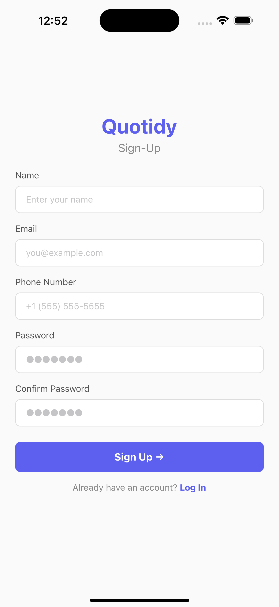

# Quotidy - Group Accountability App 🚀

**Chores, Tasks, Habits – Delightfully Organized.**  
Quotidy is a collaborative accountability app that helps households, friends, and teams track tasks, habits, and chores together.  
Stay motivated through streaks, shared progress, and simple, clean task management – without the stress of competition.

---

## 📸 Screenshots

| Sign-Up | Sign-In | Home |
|---------|---------|------|
|  |  |  |

---

## ✨ Features (Current Progress)
- **🔑 User Authentication** – Email/Password sign-up & sign-in.
- **🏠 Home Screen** – Calendar-like task layout with filters.
- **📝 Task Management** – Create, edit, and delete chores or habits.
- **🔁 Recurring Task Management** – Daily, weekly, monthly, or custom frequency.
- **👥 Group/Squad Support** *(planned)* – Assign and track group-based tasks.
- **🔥 Streak Tracking** *(planned)* – Maintain motivation through streak-based standings.
- **🎮 Gamification** *(planned)* – Achievements, badges, and rewards for top performers.

---

## 🛠 Tech Stack
- **React Native (Expo)** – Cross-platform development.
- **Zustand** – Lightweight state management.
- **Supabase** – Backend & authentication.
- **TypeScript** – Type safety and cleaner code.

---

## 📦 Installation

1. **Clone the repository**
   
   git clone https://github.com/sovinirs/TidyRealmNative.git

2. **Install dependencies**

   npm install

3. **Start the development server**

   npx expo start

4. **Run on device or simulator**

   * Press `i` for iOS simulator (Mac only).
   * Press `a` for Android emulator.
   * Scan the QR code in Expo Go app for physical device testing.

---

## 📂 Project Structure
```
.
├── assets/              # App images, icons, fonts
├── components/          # Reusable UI components
├── hooks/               # Custom React hooks
├── screens/             # App screen components
├── store/               # Zustand state management
├── utils/               # Utility functions
├── App.tsx              # Entry point
└── README.md
```
---

## 🚀 Roadmap

* [x] User authentication (sign-up, sign-in)
* [x] Recurring task creation & management
* [ ] Group/squad creation & shared task assignment
* [ ] Streak-based standings & progress tracking
* [ ] Gamified rewards system
* [ ] Push notifications & reminders

---

## 🤝 Contributing

Contributions are welcome!
If you’d like to contribute:

1. Fork the repo
2. Create a new branch (`feature/new-feature`)
3. Commit your changes
4. Push the branch and open a Pull Request

---

## 📜 License

This project is licensed under the **MIT License** – see the [LICENSE](LICENSE) file for details.

---

## 💡 About

Quotidy is currently in **MVP development** and focuses on recurring task management as the foundation for a full group accountability platform.

